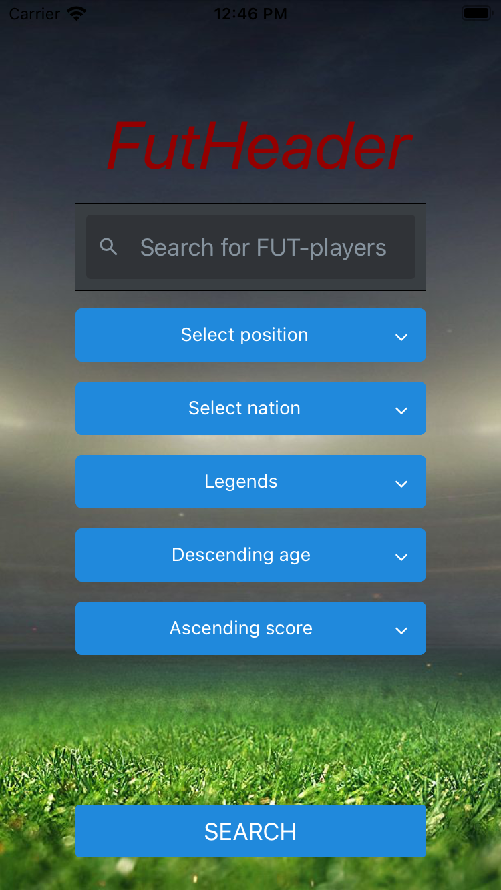
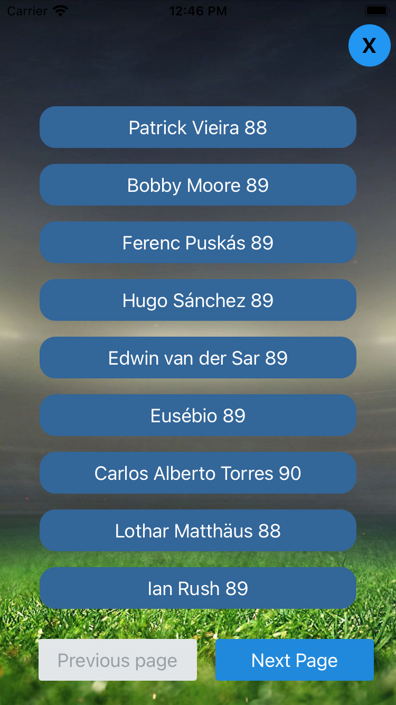
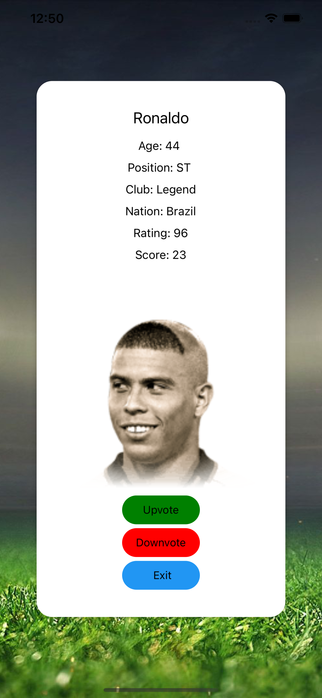

**For å kjøre prosjektet etter kloning:** <br>
Kjør `npm install expo-cli --global` for å laste ned expo-cli (dersom du ikke allerede har det installert). <br> 
`cd app` <br>
Kjør `npm install` i app-mappen. <br>
Kjør `npm start` i app-mappen for å starte applikasjonen.


# Prosjekt 4 - Gruppe 77

*  [Intro](#intro)
*  [Innhold og funksjonalitet](#innhold-og-funksjonalitet)
*  [Krav til teknologi og testing](#krav-til-teknologi-og-testing)
    *  [React Native](#react-native)
    *  [Testing](#testing)

## Intro

Vi har i denne oppgaven laget en prototyp på en mobilapp der fokus er på søk. Objektene vi søker på er fotballspillere, og applikasjonen tilbyr
funksjonalitet for å søke på, sortere og filtrere på ulike parametre. 

## Innhold og funksjonalitet

Prosjekt 4 i IT2810 - Webutvikling går ut på å sette opp, og designe en mobilapplikasjon der fokus er på søk. 
Vi har valgt å gjenbruke backend fra Prosjekt 3, og klone dette inn på virtuell maskin slik at det kjører kontinuerlig. 
Dermed har vi alltid tilgang til spillerobjektene som ligger i databasen. 

Vi har valgt å overføre all funksjonalitet fra Prosjekt 3, og tilpasse funksjonaliteten til en mobilapplikasjon.
Applikasjonen består av et søkefelt der brukeren kan søke på spillernavn. 
Brukeren har også mulighet til å filtrere på posisjon, klubb og nasjon, ved hjelp av flere dropdown-menyer på forsiden. 
Etter å ha gjennomført et søk (med resultater), vil spillerobjektene som tilfredsstiller søket listes opp 9 og 9, og det er lagt til rette for å hente ut flere resultater ved blaing i sider dersom man ønsker å se mer av resultatsettet. 
I tillegg er hvert spillerobjekt representert som en knapp. Ved å trykke på en spiller, vil man få opp et pop-up vindu med mer informasjon om den valgte spilleren. 
Her har man også muligheten til å upvote/downvote spillere, og denne scoren vil oppdateres i databasen. 

Følgende bilder viser siden før noe søk er gjennomført (1), det første resultatsettet (2) og pop-up-en som vises når man klikker på en spiller (3):


<div align="center">
    
    
    
</div>


## Krav til teknologi

### React Native
Applikasjonen er implementert ved bruk av React Native og TypeScript. Vi har valgt å gjenbruke store deler av koden fra Prosjekt 3, noe som gjorde det enkelt 
å få den funksjonaliteten vi ønsket. Vi har kun valgt å benytte oss av funksjonelle komponenter, da dette er enkelt å implementere og gir enkel og lesbar kode. 
Når det kommer til typing har vi valgt å samle alle interfaces i en egen fil, interfaces.tsx, som vi deretter importerer i de andre filene. 
Hovedkomponentene i React-applikasjonen er SearchBar.tsx og Scroller.tsx. SearchBar.tsx implementerer søkefelt, 
og er forelder til flere komponenter for sortering/filtrering. Filter.tsx er en egen fil, som igjen er forelder til spesifikke komponenter for ulik filtrering. 
Dermed ligger all funksjonalitet for søk, filtrering og sortering under SearchBar.tsx.
Scroller.tsx inneholder all funksjonalitet for å vise resultatsettet. 
Her ligger altså funksjonalitet for å vise spillerne, vise mer info om hver enkelt og bla mellom ulike sider i resultatsettet. 

**React-Native Komponenter**
<br>
I dette prosjektet måtte vi endre en del på komponentene våre i forhold til prosjekt-4. De største endringene er at alle div-komponenter til 
View-komponenter og alt som er tekst måtte inn i Text-komponenter. 

I tillegg har vi tatt i bruk en rekke andre react-native komponenter. For filtrering på klubb, nasjon og posisjon har vi brukt DropDownPicker fra 
"react-native-dropdown-picker" biblioteket. Denne erstatter Select-komponenten vår fra prosjekt-3. Dette er en dropdown-meny med valg, som setter global-state 
til valget når brukeren velger et alternativ f.eks nation: France. For at disse komponentene ikke skal gli inn i hverandre brukte zIndex for å vise de første øverst.

Vi har også brukt Modal-komponenten fra "react-native" i dette prosjektet. Samme som i prosjekt-3 brukte vi det for å vise hver enkelt spiller, men brukte det her også for å 
vise listen over spillere etter søk. Brukte her også TouchableHighlight fra samme bibliotek til å lage "Previous page" og "Next page" knappene, 
i tillegg til "X"-knappen for å returnere til søk-siden. TouchableHighlight ble også brukt til å upvote, downvote og exit på hver spiller sin modal. 

Brukte også SearchBar fra "react-native-elements" for søkefunksjonalitet.

**Styling**
<br>
Her kunne vi ikke lenger bruke CSS for styling av komponentene. Vi laget derfor ulike stylesheets for hver komponent og et eget interface for hvert av 
disse stylesheetsene. Har også brukt noe av de innebygde styling propsene til noen av komponentene, som f.eks buttonStyle på noen knapper og labelStyle
på labelen til DropDownPicker-komponentene.


Figuren under viser komponentstrukturen i applikasjonen vår:

```
app/
│
├── actions/
│   ├── ageActions.tsx
│   ├── clubActions.tsx
│   ├── …
│   └── types.tsx
│	
├── components/
│   ├── ClubSelect.tsx
│   ├──	…
│   └── SortScore.tsx
│ 		
├── images/
│   ├──	image
│   └── images.tsx
│		
├── reducers/
│   ├── inndex.tsx
│   └── playerReducer.tsx
│
├── store/
│   ├── initialState.tsx
│   └── store.tsx
│
└── App.tsx
```

Vi baserte prosjektet på Node.js, og brukte expo for å sette opp prosjektet. 
Følgende kommando ble kjørt i terminalen for å sette opp prosjektet (valgte deretter oppsett med TypeScript):

`expo init my-new-project`

### Testing
I dette prosjektet har vi foretatt oss manuell end-2-end testing. Vi har sjekket at all funksjonalitet fungerer gjennom hele appen, i tillegg til at stylingen fungerer på ulike mobilstørrelser. Vi har testet appen vår på iPhone-XR, iPhone-X, iPhone-8, iPhone-6 og iPad Pro-4. For å teste funksjonaliteten har vi blant annet laget en use-case som tester det meste av funksjonalitet. 

**Use Case**

1.	Skriv «Ron» inn i søkefeltet. 
2.	Velg «Legends» som klubb på Select Club-velgeren
3.	Sorter på «Descendig age» på Sort Age-velgeren
4.	Klikk på «SEARCH»
Da skal tre spillere fra klubben legends, som har «Ron» vises i synkende rekkefølge basert på alderen deres. De skal da ligge i rekkefølge «Ronald Koeman 88» (57 år), «Ronaldo 90» (44 år) og «Ronaldinho 89» (40 år). 
5.	Klikk på «Ronaldinho 89»
6.	Klikk på «Upvote» 3 ganger
7.	Klikk på «Downvote» 1 gang
8.	Klikk på «Exit»
9.	Klikk på «X»-knappen øverst til høyres
Du er nå tilbake på søk-siden
10.	Fjern «Ron» fra søke-feltet
11.	Sorter på «No sort on age» på Sort Age-velgeren
12.	Klikk på «SEARCH»
13.	Klikk på «Next Page»-knappen til du finner «Ronaldinho 89», skal ligge på den femte siden
14.	Klikk på «Ronaldinho 89»
15.	Scoren til Ronaldinho skal nå være 2 høyere enn det den var. 

I denne Use Casen testes det meste av funksjonalitet appen har å tilby. Tester både søk, filtrering, sortering, brukergenerert data og dynamisk lasting av objekter. I tar det brukeren gjennom hele appen. 


